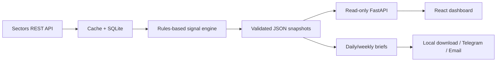

# Konsep Judging Video Flow Radar - Maksimal 3 Menit

## Sasaran video

Dalam kurang dari tiga menit, juri harus memahami empat hal:

1. masalah nyata yang dialami investor ritel Indonesia;
2. siapa yang menggunakan Flow Radar dan mengapa ada dua horizon;
3. bagaimana workflow utama berjalan dari sinyal menuju bukti dan monitoring;
4. bagaimana data Sectors diproses menjadi insight yang transparan dan dapat diverifikasi.

Video ini diposisikan untuk track **Market Intelligence**. Fokus utamanya adalah kegunaan nyata, storytelling, dan kedalaman teknis - bukan daftar seluruh menu.

## Ringkasan produk untuk narasi

**Problem statement satu kalimat:**

> Investor ritel Indonesia dapat melihat siapa yang memperdagangkan sebuah saham, tetapi sulit mengetahui apakah modal institusional sedang mengakumulasi atau keluar tanpa memeriksa tabel broker, foreign flow, fundamental, dan perubahan kepemilikan satu per satu.

**Solusi:** Flow Radar mengubah data Sectors untuk universe LQ45 menjadi dua ranking yang transparan:

- **Daily Flow** untuk trader: skor -100 sampai +100 dari foreign flow lima hari, streak, konsentrasi broker, institutional net flow, divergence, dan aktivitas insider.
- **Investor Lens** untuk investor: skor 0 sampai 100 dari quality 40%, valuation 25%, dan slow flow 35%, lengkap dengan coverage data.

Setiap skor menampilkan alasan, input, kontribusi, seri historis, dan keterbatasannya. Output akhirnya dapat digunakan di dashboard, watchlist, brief harian/mingguan, serta delivery Telegram/email. Produk memberi informasi dan analisis - bukan rekomendasi transaksi.

## Flow teknis yang perlu divisualkan

Narasi teknis cukup 12-15 detik. Diagram dapat ditambahkan sebagai overlay sederhana saat voice-over menjelaskan pipeline.

## Strategi demo

Gunakan **PGEO sebagai benang merah** karena snapshot 2 Oktober 2026 memperlihatkan workflow lengkap:

- Daily rank **#3** dengan flow score **+16,8**;
- berubah dari **neutral 11,5** menjadi **accumulation 16,8**;
- institutional brokers menunjukkan net accumulation sebesar **42% dari net traded value** dalam dua minggu;
- Investor rank **#9**, coverage **100%**, dengan slow-flow pillar sekitar **71,9**;
- valuasi PE dan PB sekitar **0,76x peer average** dalam data yang diekspor.

Angka-angka tersebut adalah observasi pada snapshot, bukan prediksi hasil investasi.

## Storyboard utama

| Waktu | Bagian | Tampilan dan aksi | Pesan yang harus tertangkap |
| --- | --- | --- | --- |
| 00:00-00:18 | Masalah | Mulai dari Overview; sisipkan overlay tabel broker yang padat bila tersedia. | Data tersedia, tetapi proses menemukan sinyal masih lambat dan terfragmentasi. |
| 00:18-00:35 | Audiens dan solusi | Tampilkan dua CTA: Daily flow dan Investor lens. | Satu produk, dua horizon pengguna. |
| 00:35-00:52 | Orientasi | Tunjukkan empat metric cards, breadth, tanggal snapshot, LQ45, dan attribution Sectors. | Cakupan pasar dan konteks selalu terlihat. |
| 00:52-01:22 | Daily workflow | Buka Daily flow, filter Accumulation, cari PGEO, expand **Explain this score**. | Ranking transparan dan dapat difilter; komponen skor dapat diaudit. |
| 01:22-02:02 | Bukti saham | Masuk ke PGEO. Tampilkan dua score cards, ubah chart range 20 ke 60, lalu scroll foreign flow dan top brokers. | Pengguna bergerak dari sinyal menuju bukti, bukan berhenti pada ranking. |
| 02:02-02:24 | Investor workflow | Buka Investor lens, cari PGEO, tampilkan pillar bars dan coverage. | Fundamental dan arus modal jangka panjang terhubung dalam satu konteks. |
| 02:24-02:40 | Monitoring | Bintangi PGEO, buka Watchlist, lalu Market brief dan sorot score flip PGEO. | Insight berubah menjadi workflow riset berulang. |
| 02:40-02:54 | Kedalaman teknis | Tampilkan diagram pipeline atau Methodology. | Sectors adalah sumber inti; scoring deterministik, tervalidasi, dan explainable. |
| 02:54-02:59 | Penutup | End card dengan brand, track, attribution, disclaimer. | Nama produk dan proposisi nilai melekat. |

## Naskah Bahasa Indonesia

> Durasi sasaran voice-over: 2 menit 45 detik sampai 2 menit 55 detik. Baca natural; jangan mempercepat bagian bukti PGEO.

| Waktu | Narasi | Aksi layar |
| --- | --- | --- |
| 00:00-00:18 | Investor ritel Indonesia sudah dapat melihat broker summary, foreign flow, fundamental, dan data kepemilikan. Masalahnya, data itu tersebar. Untuk menemukan akumulasi yang bermakna, pengguna masih harus membuka banyak tabel dan membandingkannya satu per satu. | Overview, lalu overlay singkat data/tabel yang padat. |
| 00:18-00:35 | Flow Radar adalah market intelligence untuk saham LQ45, dibangun di atas Sectors Financial API. Penggunanya ada dua: trader yang ingin tahu ke mana modal bergerak hari ini, dan investor yang ingin melihat apakah perusahaan yang solid sedang diakumulasi dalam horizon lebih panjang. | Sorot tombol Daily flow dan Investor lens. |
| 00:35-00:52 | Overview merangkum breadth pasar, jumlah saham dalam akumulasi atau distribusi, serta pemimpin di masing-masing horizon. Tanggal snapshot, sumber data, dan disclaimer selalu terlihat agar setiap angka memiliki konteks. | Scroll perlahan melalui metric cards dan breadth. |
| 00:52-01:22 | Kita mulai dari Daily Flow. Skor berjalan dari minus seratus untuk distribusi sampai plus seratus untuk akumulasi. Ranking dapat dicari dan difilter berdasarkan sinyal maupun sektor. PGEO berada di peringkat tiga dengan skor 16,8. Saat penjelasannya dibuka, kita melihat kontribusi foreign flow, streak, konsentrasi broker, institutional net flow, divergence, dan insider - bukan skor misterius. | Filter Accumulation, fokus PGEO, buka Explain this score. |
| 01:22-02:02 | Klik PGEO untuk memeriksa buktinya. Dalam satu halaman, Flow Radar menghubungkan skor harian dan investor dengan pergerakan harga, foreign flow harian dan kumulatif, riwayat flow score, perubahan komposisi pemegang saham, serta broker pembeli dan penjual terbesar. Pada snapshot ini, broker institusional menunjukkan net accumulation sekitar 42 persen dari net traded value selama dua minggu. Range grafik juga dapat diubah agar pengguna dapat membandingkan 20 sesi, 60 sesi, atau seluruh histori yang tersedia. | Buka PGEO, sorot dua skor, ubah range, scroll grafik dan tabel broker. |
| 02:02-02:24 | Investor Lens menjawab pertanyaan yang berbeda. Skor ini menggabungkan quality 40 persen, valuation 25 persen, dan slow flow 35 persen. PGEO berada di peringkat sembilan dengan coverage 100 persen; setiap input dan alasan tetap dapat diperiksa sebelum masuk watchlist. | Buka Investor lens, cari PGEO, sorot pilar dan coverage, lalu bintangi. |
| 02:24-02:40 | Watchlist menjaga riset tetap fokus. Market Brief kemudian merangkum perubahan yang layak diperiksa. Di sini, PGEO berubah dari netral 11,5 menjadi akumulasi 16,8. Brief harian dan mingguan juga dapat diunduh, atau diformat untuk Telegram dan email. | Buka Watchlist, lalu Market brief dan sorot score flip PGEO serta tombol download. |
| 02:40-02:54 | Di belakang layar, data inti Sectors disimpan di SQLite, dihitung dengan aturan transparan, divalidasi sebagai snapshot JSON, lalu disajikan melalui FastAPI dan React. Hasilnya deterministik dan dapat diaudit. | Tampilkan diagram pipeline, lalu Methodology. |
| 02:54-02:59 | Flow Radar: clarity behind the capital. Informasi, bukan nasihat investasi. | End card. |

## English Script

> Target voice-over length: 2 minutes 45 seconds to 2 minutes 55 seconds. Keep a natural pace and leave room for the PGEO evidence to remain readable.

| Time | Voice-over | On-screen action |
| --- | --- | --- |
| 00:00-00:18 | Indonesian retail investors can already access broker summaries, foreign flow, fundamentals, and ownership data. The problem is fragmentation. Finding a meaningful accumulation signal still means opening multiple tables and comparing them one by one. | Show the Overview, then a brief overlay of dense source tables. |
| 00:18-00:35 | Flow Radar is market intelligence for LQ45 equities, built on the Sectors Financial API. It serves two users: traders asking where capital is moving today, and investors asking whether strong companies are being accumulated over a longer horizon. | Highlight the Daily flow and Investor lens actions. |
| 00:35-00:52 | The Overview summarizes market breadth, the number of stocks under accumulation or distribution, and the leaders for both horizons. The snapshot date, data source, and disclaimer stay visible, so every number keeps its context. | Move through the metric cards and breadth chart. |
| 00:52-01:22 | Start with Daily Flow. Scores run from minus one hundred for distribution to plus one hundred for accumulation. The ranking can be searched and filtered by signal or sector. PGEO ranks third with a score of 16.8. Expand the explanation to inspect foreign flow, streak, broker concentration, institutional net flow, divergence, and insider activity - not a mysterious black-box score. | Filter Accumulation, focus on PGEO, and expand Explain this score. |
| 01:22-02:02 | Open PGEO to inspect the evidence. One research page connects its daily and investor scores with price action, daily and cumulative foreign flow, score history, ownership composition, and the leading buying and selling brokers. In this snapshot, institutional brokers show net accumulation equal to about 42 percent of net traded value over two weeks. Change the chart window to compare 20 sessions, 60 sessions, or all available history. | Open PGEO, show both scores, change the range, then scroll through charts and broker tables. |
| 02:02-02:24 | Investor Lens answers a different question. Its score combines 40 percent quality, 25 percent valuation, and 35 percent slow flow. PGEO ranks ninth with full input coverage, and every input and reason remains available for inspection before the stock enters a watchlist. | Open Investor Lens, find PGEO, highlight pillars and coverage, then star it. |
| 02:24-02:40 | The watchlist keeps research focused. Market Brief then captures the changes worth investigating. Here, PGEO moves from neutral at 11.5 to accumulation at 16.8. Daily and weekly briefs can also be downloaded, or formatted for Telegram and email. | Open Watchlist, then Market Brief; highlight PGEO's score flip and the download buttons. |
| 02:40-02:54 | Behind the interface, core Sectors data enters SQLite, passes through transparent rules, becomes validated JSON snapshots, and is served through FastAPI and React. The result is deterministic and auditable. | Show the pipeline diagram, then Methodology. |
| 02:54-02:59 | Flow Radar: clarity behind the capital. Information, not investment advice. | Show the end card. |

## Arahan produksi

- Rekam voice-over lebih dahulu, lalu sesuaikan screen recording terhadap ritmenya.
- Gunakan chapter card sangat singkat: **The Problem**, **Two Horizons**, **Follow the Evidence**, dan **What Changed**.
- Pertahankan cursor pada elemen yang sedang dibahas; jangan melakukan klik saat kalimat penting belum selesai.
- Beri zoom editor pada komponen PGEO ketika kontribusi skor dan angka 42% disebut.
- Diagram teknis harus tetap sederhana; tidak perlu memperlihatkan source code kecuali ada waktu lebih.
- Jika durasi terlalu panjang, potong overlay masalah dan chart-range interaction terlebih dahulu. Jangan memotong problem, audiens, core workflow, atau attribution Sectors.
- Gunakan satu bahasa voice-over per versi video. Jangan mencampur narasi Inggris dan Indonesia dalam satu upload.

## Checklist validasi isi

- [ ] Problem dan intended audience dijelaskan dalam 35 detik pertama.
- [ ] Core workflow terlihat end-to-end: ranking -> explanation -> stock evidence -> watchlist/brief.
- [ ] Daily Flow dan Investor Lens dibedakan dengan jelas.
- [ ] Sectors Financial API disebut sebagai sumber data inti.
- [ ] Contoh PGEO dan angka yang disebut cocok dengan snapshot yang direkam.
- [ ] Tidak ada klaim rekomendasi, prediksi return, atau jaminan hasil.
- [ ] Disclaimer terlihat pada penutup dan tetap tersedia di UI.
- [ ] Durasi final di bawah 3:00, idealnya 2:50-2:57.
- [ ] Video dapat dibuka juri tanpa meminta akses: YouTube/Vimeo public atau unlisted, Google Drive link-sharing aktif, atau Loom.
